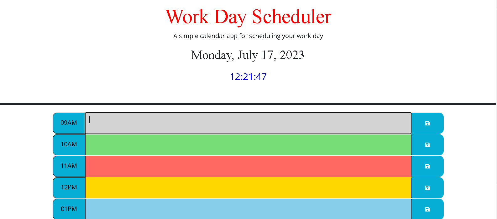
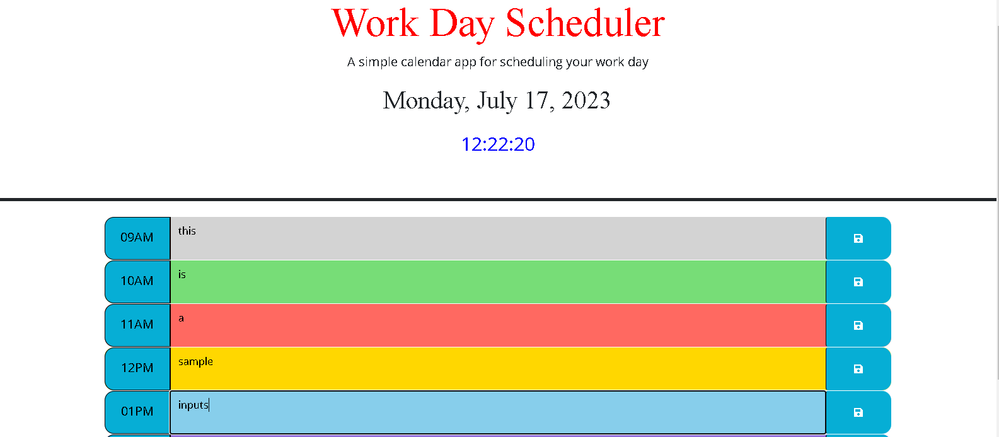

# DayJS Format

This repository contains a simple web page that utilizes the DayJS library to answer various date and time-related questions. It displays questions and their corresponding answers on the page. The answers are generated using DayJS methods to format dates, calculate differences, and parse timestamps.

## Live Demo

You can see the live demo of this project [here](https://hyperlitz.github.io/Lito_Workscheduler).

## Repository

The source code for this project is available on [GitHub](https://github.com/hyperlitz/Lito_Workscheduler).

## Screenshots

## Installation

To set up the project locally, follow these steps:

1. Clone the repository: `git clone https://github.com/your-username/repository.git`
2. Navigate to the project directory: `cd repository`
3. Open the `index.html` file in your web browser.

## Usage

Once you have opened the `index.html` file in your web browser, you will see a list of questions related to dates and times. The answers to these questions are dynamically generated using the DayJS library.

## Technologies Used

The project uses the following technologies:

- HTML
- CSS
- JavaScript
- [DayJS](https://day.js.org/) - A minimalist JavaScript library for date and time manipulation

## Contributing

Contributions are welcome! If you find any issues or have suggestions for improvements, please create a new issue or submit a pull request.

## License

This project is licensed under the [MIT License](https://opensource.org/licenses/MIT).

## Acknowledgements

- [DayJS](https://day.js.org/) - The JavaScript library used in this project for date and time manipulation.
- [jQuery](https://jquery.com/) - The JavaScript library used for DOM manipulation.